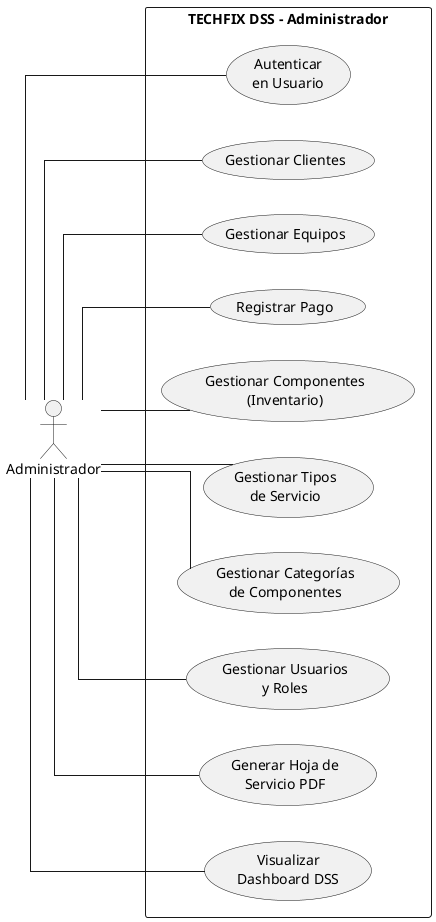
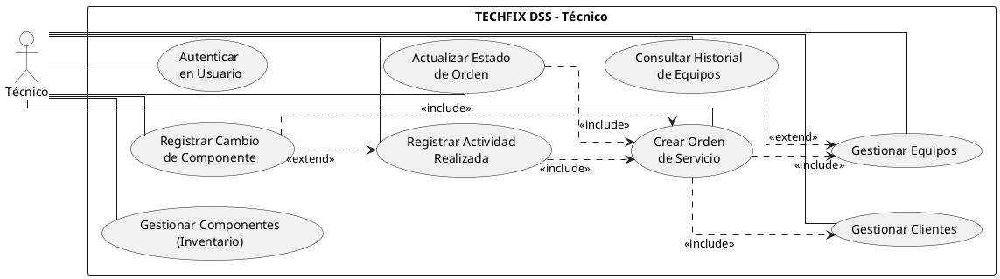

## Diagrama de Casos de Uso — Administrador

```plantuml
@startuml
left to right direction
skinparam packageStyle rectangle
skinparam linetype ortho

actor "Administrador" as admin

rectangle "TECHFIX DSS - Administrador" {

  usecase "Autenticar\nen Usuario" as UC15
  usecase "Gestionar Clientes" as UC01
  usecase "Gestionar Equipos" as UC02
  usecase "Registrar Pago" as UC08
  usecase "Gestionar Componentes\n(Inventario)" as UC09
  usecase "Gestionar Tipos\nde Servicio" as UC10
  usecase "Gestionar Categorías\nde Componentes" as UC11
  usecase "Gestionar Usuarios\ny Roles" as UC12
  usecase "Generar Hoja de\nServicio PDF" as UC13
  usecase "Visualizar\nDashboard DSS" as UC14

  admin -- UC15
  admin -- UC01
  admin -- UC02
  admin -- UC08
  admin -- UC09
  admin -- UC10
  admin -- UC11
  admin -- UC12
  admin -- UC13
  admin -- UC14
}
@enduml
```

---

## Diagrama de Casos de Uso — Técnico

```plantuml
@startuml
left to right direction
skinparam packageStyle rectangle
skinparam linetype ortho

actor "Técnico" as tecnico

rectangle "TECHFIX DSS - Técnico" {

  usecase "Autenticar \nen Usuario" as UC15

  usecase "Gestionar Clientes" as UC01
  usecase "Gestionar Equipos" as UC02
  usecase "Consultar Historial\nde Equipos" as UC03
  usecase "Crear Orden\nde Servicio" as UC04
  usecase "Actualizar Estado\nde Orden" as UC05
  usecase "Registrar Actividad\nRealizada" as UC06
  usecase "Registrar Cambio\nde Componente" as UC07
  usecase "Gestionar Componentes\n(Inventario)" as UC09

  tecnico -- UC15
  tecnico -- UC01
  tecnico -- UC02
  tecnico -- UC03
  tecnico -- UC04
  tecnico -- UC05
  tecnico -- UC06
  tecnico -- UC07
  tecnico -- UC09

  UC04 ..> UC01 : <<include>>
  UC04 ..> UC02 : <<include>>

  UC05 ..> UC04 : <<include>>
  UC06 ..> UC04 : <<include>>
  UC07 ..> UC04 : <<include>>

  UC03 ..> UC02 : <<extend>>
  UC07 ..> UC06 : <<extend>>
}
@enduml
```
