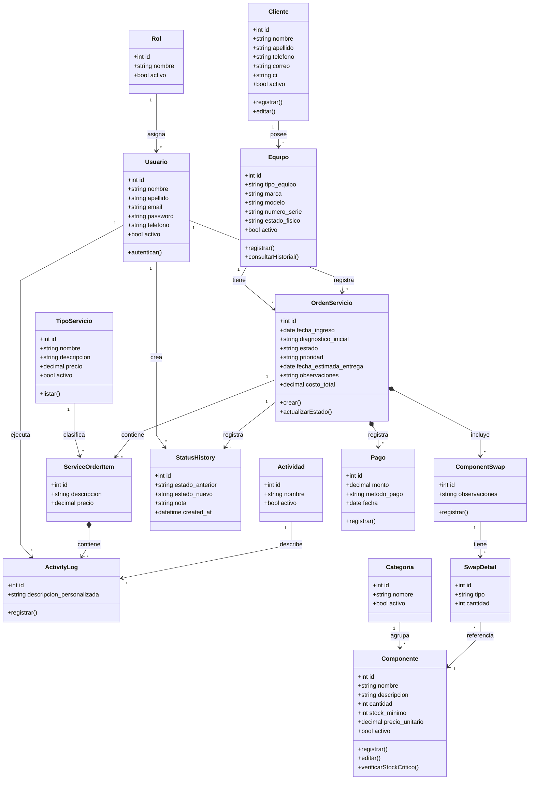

```mermaid
%%{init: {'flowchart': {'curve': 'linear'}}}%%

classDiagram

class Cliente {
    +int id
    +string nombre
    +string apellido
    +string telefono
    +string correo
    +string ci
    +bool activo
    +registrar()
    +editar()
}

class Equipo {
    +int id
    +string tipo_equipo
    +string marca
    +string modelo
    +string numero_serie
    +string estado_fisico
    +bool activo
    +registrar()
    +consultarHistorial()
}

class TipoServicio {
    +int id
    +string nombre
    +string descripcion
    +decimal precio
    +bool activo
    +listar()
}

class OrdenServicio {
    +int id
    +date fecha_ingreso
    +string diagnostico_inicial
    +string estado
    +string prioridad
    +date fecha_estimada_entrega
    +string observaciones
    +decimal costo_total
    +crear()
    +actualizarEstado()
}

class ServiceOrderItem {
    +int id
    +string descripcion
    +decimal precio
}

class Actividad {
    +int id
    +string nombre
    +bool activo
}

class ActivityLog {
    +int id
    +string descripcion_personalizada
    +registrar()
}

class StatusHistory {
    +int id
    +string estado_anterior
    +string estado_nuevo
    +string nota
    +datetime created_at
}

class Categoria {
    +int id
    +string nombre
    +bool activo
}

class Componente {
    +int id
    +string nombre
    +string descripcion
    +int cantidad
    +int stock_minimo
    +decimal precio_unitario
    +bool activo
    +registrar()
    +editar()
    +verificarStockCritico()
}

class ComponentSwap {
    +int id
    +string observaciones
    +registrar()
}

class SwapDetail {
    +int id
    +string tipo
    +int cantidad
}

class Pago {
    +int id
    +decimal monto
    +string metodo_pago
    +date fecha
    +registrar()
}

class Rol {
    +int id
    +string nombre
    +bool activo
}

class Usuario {
    +int id
    +string nombre
    +string apellido
    +string email
    +string password
    +string telefono
    +bool activo
    +autenticar()
}

Cliente "1" --> "*" Equipo : posee

Equipo "1" --> "*" OrdenServicio : tiene

TipoServicio "1" --> "*" ServiceOrderItem : clasifica

Rol "1" --> "*" Usuario : asigna

Usuario "1" --> "*" OrdenServicio : registra

Usuario "1" --> "*" ActivityLog : ejecuta

Usuario "1" --> "*" StatusHistory : crea

OrdenServicio "1" --> "*" ServiceOrderItem : contiene

OrdenServicio "1" --> "*" StatusHistory : registra

ServiceOrderItem *--> "*" ActivityLog : contiene

Actividad "1" --> "*" ActivityLog : describe

Categoria "1" --> "*" Componente : agrupa

OrdenServicio *--> "*" ComponentSwap : incluye

ComponentSwap "1" --> "*" SwapDetail : tiene

SwapDetail "*" --> "1" Componente : referencia

OrdenServicio *--> "*" Pago : registra
```
