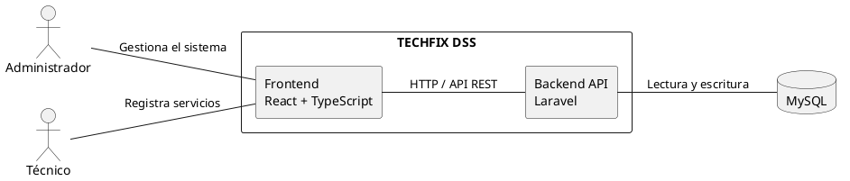

```plantuml
@startuml
left to right direction
skinparam packageStyle rectangle

rectangle "TECHFIX DSS" as sistema {
  rectangle "Frontend\nReact + TypeScript" as frontend
  rectangle "Backend API\nLaravel" as backend
}

actor "Administrador" as admin
actor "Técnico" as tecnico

database "MySQL" as db

admin -- frontend : Gestiona el sistema
tecnico -- frontend : Registra servicios

frontend -- backend : HTTP / API REST
backend -- db : Lectura y escritura

@enduml
```
