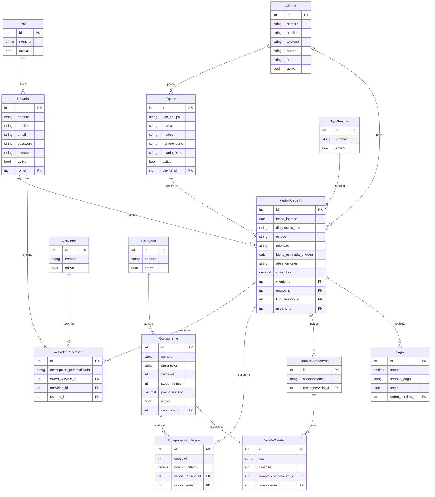

```mermaid
erDiagram
    Rol {
        int id PK
        string nombre
        bool activo
    }

    Usuario {
        int id PK
        string nombre
        string apellido
        string email
        string password
        string telefono
        bool activo
        int rol_id FK
    }

    Cliente {
        int id PK
        string nombre
        string apellido
        string telefono
        string correo
        string ci
        bool activo
    }

    Equipo {
        int id PK
        string tipo_equipo
        string marca
        string modelo
        string numero_serie
        string estado_fisico
        bool activo
        int cliente_id FK
    }

    TipoServicio {
        int id PK
        string nombre
        bool activo
    }

    OrdenServicio {
        int id PK
        date fecha_ingreso
        string diagnostico_inicial
        string estado
        string prioridad
        date fecha_estimada_entrega
        string observaciones
        decimal costo_total
        int cliente_id FK
        int equipo_id FK
        int tipo_servicio_id FK
        int usuario_id FK
    }

    Actividad {
        int id PK
        string nombre
        bool activo
    }

    ActividadRealizada {
        int id PK
        string descripcion_personalizada
        int orden_servicio_id FK
        int actividad_id FK
        int usuario_id FK
    }

    Categoria {
        int id PK
        string nombre
        bool activo
    }

    Componente {
        int id PK
        string nombre
        string descripcion
        int cantidad
        int stock_minimo
        decimal precio_unitario
        bool activo
        int categoria_id FK
    }

    ComponenteUtilizado {
        int id PK
        int cantidad
        decimal precio_unitario
        int orden_servicio_id FK
        int componente_id FK
    }

    CambioComponente {
        int id PK
        string observaciones
        int orden_servicio_id FK
    }

    DetalleCambio {
        int id PK
        string tipo
        int cantidad
        int cambio_componente_id FK
        int componente_id FK
    }

    Pago {
        int id PK
        decimal monto
        string metodo_pago
        date fecha
        int orden_servicio_id FK
    }

    Rol ||--o{ Usuario : tiene
    Usuario ||--o{ OrdenServicio : registra
    Usuario ||--o{ ActividadRealizada : ejecuta
    Cliente ||--o{ Equipo : posee
    Cliente ||--o{ OrdenServicio : tiene
    Equipo ||--o{ OrdenServicio : genera
    TipoServicio ||--o{ OrdenServicio : clasifica
    OrdenServicio ||--o{ ActividadRealizada : contiene
    Actividad ||--o{ ActividadRealizada : describe
    OrdenServicio ||--o{ ComponenteUtilizado : consume
    Componente ||--o{ ComponenteUtilizado : usado_en
    OrdenServicio ||--o{ CambioComponente : incluye
    CambioComponente ||--o{ DetalleCambio : tiene
    Componente ||--o{ DetalleCambio : referencia
    Categoria ||--o{ Componente : agrupa
    OrdenServicio ||--o{ Pago : registra
```
