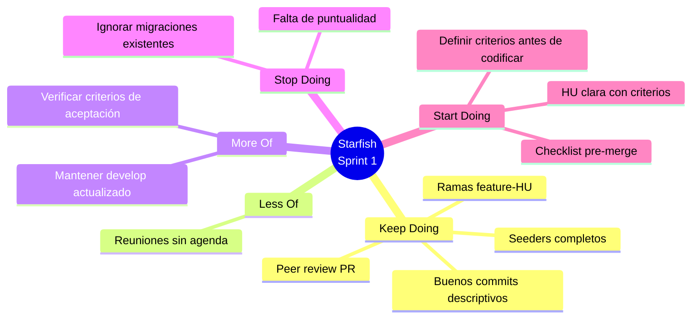

# Retrospectiva Sprint 1 — Starfish

## Decisiones Tomadas (Acciones SMART)

| ¿Qué vamos a mejorar? | ¿Cómo sabremos que funcionó? | Guardián |
|------------------------|------------------------------|----------|
| Verificar los criterios de aceptación antes de comenzar a desarrollar cada historia de usuario. | Se reducirá la cantidad de refactorizaciones durante la implementación y habrá menos cambios por incumplimiento de requisitos. | Kehila Molina |
| Mantener la rama develop actualizada después de cada merge. | La rama develop contendrá siempre la última historia de usuario integrada y no presentará conflictos pendientes. | Brayan Quispe |

## Tarea en GitHub Projects
[Enlace a la tarea creada en Sprint 2](URL-del-tablero)
